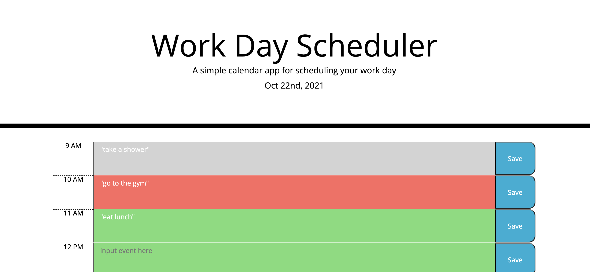

# HW5 Third-Party APIs: Work Day Scheduler

## Description

This program is a simple calendar application that allows a user to save events for each hour of the day by modifying starter code. This app runs in the browser and features dynamically updated HTML and CSS powered by jQuery.

## Mock-Up

The following screenshot demonstrates the application functionality:

## Links

- [Deployed Link](https://hyanez.github.io/HW5-WORK-DAY-SCHEDULER/)
- [Github Link](https://github.com/hyanez/HW5-WORK-DAY-SCHEDULER)
